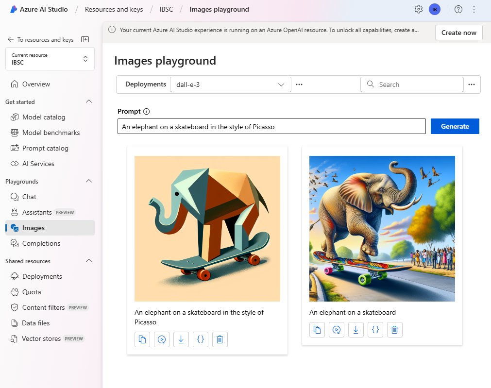

---
lab:
  title: Générer des images avec un modèle DALL-E
---

# Générer des images avec un modèle DALL-E

Azure OpenAI Service comprend un modèle de génération d’images appelé DALL-E. Vous pouvez utiliser ce modèle pour envoyer des prompts en langage naturel qui décrivent une image que vous voulez, et le modèle génère une image originale basée sur la description que vous fournissez.

Dans cet exercice, vous allez utiliser un modèle DALL-E version 3 pour générer des images basées sur des prompts en langage naturel.

Cet exercice prend environ **25** minutes.

## Provisionner une ressource Azure OpenAI

Avant de pouvoir utiliser Azure OpenAI pour générer des images, vous devez approvisionner une ressource Azure OpenAI dans votre abonnement Azure. La ressource doit se trouver dans une région où les modèles DALL-E sont pris en charge.

1. Connectez-vous au **portail Azure** à l’adresse `https://portal.azure.com`.
1. Créez une ressource **Azure OpenAI** avec les paramètres suivants :
    - **Abonnement** : *Sélectionner un abonnement Azure qui a été approuvé pour pouvoir accéder à Azure OpenAI Service, y compris DALL-E*
    - **Groupe de ressources** : *sélectionnez ou créez un groupe de ressources*.
    - **Région** : *Choisir **USA Est** ou **Suède Centre***\*
    - **Nom** : *un nom unique de votre choix*
    - **Niveau tarifaire** : Standard S0

    > \* Les modèles DALL-E 3 sont disponibles uniquement dans les ressources Azure OpenAI Service dans les régions **USA Est** et **Suède Centre**.

1. Attendez la fin du déploiement. Accédez ensuite à la ressource Azure OpenAI déployée dans le portail Azure.
1. Sur la page **Vue d’ensemble** de votre ressource Azure OpenAI,, faites défiler jusqu’à la section **Démarrer** et sélectionnez le bouton permettant d’accéder au **portail AI Foundry** (anciennement AI Studio).
1. Dans le portail Azur AI Foundry, dans le panneau de gauche, sélectionnez la page **Déploiements** et affichez vos modèles de déploiement existants. Si vous n’en avez pas encore pour DALL-E 3, créez un déploiement du modèle **dall-e-3** avec les paramètres suivants :
    - **Nom du déploiement** : dalle3
    - **Version du modèle** : *utiliser la version par défaut*
    - **Type de déploiement** : Standard
    - **Unités de capacité** : 1K
    - **Filtre de contenu** : valeur par défaut
    - **Activer le quota dynamique** : désactivé
1. Une fois le déploiement effectué, revenez à la page **Images** dans le volet gauche.

## Explorer la génération d’images sur le terrain de jeu Images

Vous pouvez utiliser le terrain de jeu Images dans le **portail Azure AI Foundry** pour expérimenter la génération d’images.

1. Dans la section **Terrain de jeu Images**, votre déploiement de DALL-E 3 doit être sélectionné automatiquement. Si ce n’est pas le cas, sélectionnez-le dans la liste déroulante des déploiements.
1. Dans la zone **Prompt**, entrez une description d’une image que vous souhaitez générer. Par exemple, `An elephant on a skateboard`, puis sélectionnez **Générer** et visualisez l’image générée.

    

1. Modifiez le prompt pour fournir une description plus spécifique. Par exemple, `An elephant on a skateboard in the style of Picasso`. Ensuite, générez la nouvelle image et regardez les résultats.

    

## Utiliser l’API REST pour générer des images

Azure OpenAI Service fournit une API REST que vous pouvez utiliser pour envoyer des prompts de génération de contenu, y compris les images générées par un modèle DALL-E.

### Préparer le développement d’une application dans Visual Studio Code

Découvrons maintenant comment vous pourriez créer une application personnalisée qui utilise Azure OpenAI Service pour générer des images. Vous allez développer votre application à l’aide de Visual Studio Code. Les fichiers de code de votre application ont été fournis dans un référentiel GitHub.

> **Conseil** : Si vous avez déjà cloné le dépôt **mslearn-openai**, ouvrez-le dans Visual Studio Code. Dans le cas contraire, procédez comme suit pour le cloner dans votre environnement de développement.

1. Démarrez Visual Studio Code.
2. Ouvrez la palette (Maj+CTRL+P) et exécutez une commande **Git : Cloner** pour cloner le référentiel `https://github.com/MicrosoftLearning/mslearn-openai` vers un dossier local (peu importe quel dossier).
3. Lorsque le référentiel a été cloné, ouvrez le dossier dans Visual Studio Code.

    > **Remarque** : Si Visual Studio Code affiche un message contextuel qui vous invite à approuver le code que vous ouvrez, cliquez sur l’option **Oui, je fais confiance aux auteurs** dans la fenêtre contextuelle.

4. Attendez que des fichiers supplémentaires soient installés pour prendre en charge les projets de code C# dans le référentiel.

    > **Remarque** : si vous êtes invité à ajouter des ressources requises pour générer et déboguer, sélectionnez **Not Now** (Pas maintenant).

### Configuration de votre application

Des applications pour C# et Python sont fournies. Les deux applications présentent les mêmes fonctionnalités. Tout d’abord, vous allez ajouter le point de terminaison et la clé de votre ressource Azure OpenAI au fichier de configuration de l’application.

1. Dans Visual Studio Code, dans le volet **Explorateur**, accédez au dossier **Labfiles/05-image-generation**, puis développez le dossier **CSharp** ou **Python**, selon le langage que vous préférez. Chaque dossier contient les fichiers propres au langage d’une application dans laquelle vous allez intégrer des fonctionnalités Azure OpenAI.
2. Dans le volet **Explorateur**, dans le dossier **CSharp** ou **Python**, ouvrez le fichier de configuration du langage de votre choix

    - **C#** : appsettings.json
    - **Python** : .env
    
3. Mettez à jour les valeurs de configuration pour inclure le **point de terminaison** et la **clé** de la ressource Azure OpenAI que vous avez créée (disponible dans la page **Clés et point de terminaison** de votre ressource Azure OpenAI dans le portail Azure).
4. Enregistrez le fichier de configuration.

### Voir le code d’application

Vous êtes maintenant prêt à explorer le code utilisé pour appeler l’API REST et générer une image.

1. Dans le volet **Explorateur**, sélectionnez le fichier de code principal de votre application :

    - C#: `Program.cs`
    - Python : `generate-image.py`

2. Passez en revue le code que contient le fichier, en notant les fonctionnalités clés suivantes :
    - Le code envoie une requête https au point de terminaison de votre service, y compris la clé de votre service dans l’en-tête. Ces deux valeurs sont obtenues dans le fichier de configuration.
    - La requête contient certains paramètres, notamment le prompt sur lequel doit être basée l’image, le nombre d’images à générer et la taille de la ou des images générées.
    - La réponse contient un prompt révisé que le modèle DALL-E a extrapolé du prompt fourni par l’utilisateur pour le rendre plus descriptif, ainsi que l’URL de l’image générée.
    
    > **Important** : si vous avez donné à votre déploiement un nom autre que celui recommandé, *dalle3*, vous devez modifier le code pour utiliser le nom de votre déploiement.

### Exécuter l’application

Maintenant que vous avez revu le code, il est temps de l’exécuter et de générer des images.

1. Cliquez avec le bouton droit sur le dossier **CSharp** ou **Python** contenant vos fichiers de code, puis ouvrez un terminal intégré. Entrez ensuite la commande appropriée pour exécuter votre application :

   **C#**
   ```
   dotnet run
   ```
   
   **Python**
   ```
   pip install requests
   python generate-image.py
   ```

3. Lorsque vous y êtes invité, entrez une description pour une image. Par exemple, *Une girafe faisant voler un cerf-volant*.

4. Attendez que l’image soit générée. Un lien hypertexte s’affiche dans le volet du terminal. Sélectionnez ensuite le lien hypertexte pour ouvrir un nouvel onglet de navigateur et regarder l’image qui a été générée.

   > **CONSEIL** : Si l’application ne retourne pas de réponse, attendez une minute et réessayez. Les ressources nouvellement déployées peuvent prendre jusqu’à 5 minutes avant d’être disponibles.

5. Fermez l’onglet du navigateur contenant l’image générée et réexécutez l’application pour générer une nouvelle image avec un autre prompt.

## Nettoyage

Lorsque vous avez terminé avec votre ressource Azure OpenAI, n’oubliez pas de la supprimer dans le **portail Azure** sur `https://portal.azure.com`.
