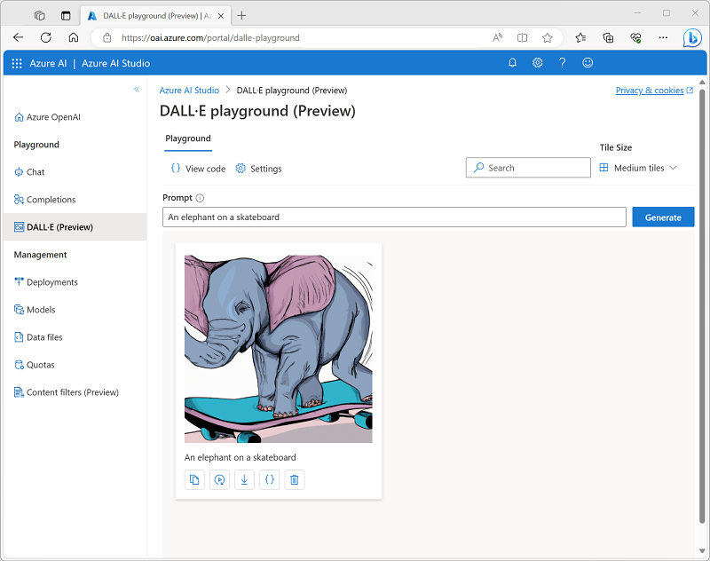

---
lab:
  title: Générer des images avec un modèle DALL-E
---

# Générer des images avec un modèle DALL-E

Azure OpenAI Service comprend un modèle de génération d’images appelé DALL-E. Vous pouvez utiliser ce modèle pour envoyer des prompts en langage naturel qui décrivent une image que vous voulez, et le modèle génère une image originale basée sur la description que vous fournissez.

Cet exercice prend environ **25** minutes.

## Avant de commencer

Vous devez avoir un abonnement Azure qui a été approuvé pour pouvoir accéder à Azure OpenAI Service, y compris DALL-E. Si vous avez déjà demandé l’accès à Azure OpenAI Service, vous devrez peut-être envoyer une autre demande pour accéder à DALL-E.

- Pour obtenir un abonnement gratuit à Azure, visitez [https://azure.microsoft.com/free](https://azure.microsoft.com/free).
- Pour demander l’accès à Azure OpenAI Service, visitez [https://aka.ms/oaiapply](https://aka.ms/oaiapply).

## Provisionner une ressource Azure OpenAI

Avant de pouvoir utiliser des modèles Azure OpenAI, vous devez provisionner une ressource Azure OpenAI dans votre abonnement Azure.

1. Connectez-vous au [portail Azure](https://portal.azure.com).
2. Créez une ressource **Azure OpenAI** avec les paramètres suivants :
    - **Abonnement** : Un abonnement Azure qui a été approuvé pour pouvoir accéder à Azure OpenAI Service.
    - **Groupe de ressources** : choisissez un groupe de ressources existant ou créez un groupe de ressources en lui attribuant le nom de votre choix.
    - **Région** : choisissez **EastUS** comme région
    - **Nom** : Un nom unique de votre choix.
    - **Niveau tarifaire** : Standard S0
3. Attendez la fin du déploiement. Accédez ensuite à la ressource Azure OpenAI déployée dans le portail Azure.
4. Accédez à la page **Clés et point de terminaison**. Vous pouvez récupérer le point de terminaison unique et les clés d’authentification de votre service à partir d’ici, vous en aurez besoin plus tard !

## Explorer la génération d’images sur le terrain de jeu DALL-E

Vous pouvez utiliser le terrain de jeu DALL-E dans **Azure OpenAI Studio** pour expérimenter la génération d’images.

1. Dans le portail Azure, dans la page **Vue d’ensemble** de votre ressource Azure OpenAI, utilisez le bouton **Explorer** pour ouvrir Azure OpenAI Studio sous un nouvel onglet du navigateur. Vous pouvez aussi accéder à [Azure OpenAI Studio](https://oai.azure.com/?azure-portal=true) directement.
2. Sélectionnez le **terrain de jeu DALL-E**.
3. Dans la zone **Prompt**, entrez une description d’une image que vous souhaitez générer. Par exemple, *Un éléphant sur un skateboard*. Sélectionnez ensuite **Générer** et visualisez l’image générée.

    

4. Modifiez le prompt pour fournir une description plus spécifique. Par exemple *Un éléphant sur un skateboard dans le style de Picasso*. Ensuite, générez la nouvelle image et regardez les résultats.

    

## Utiliser l’API REST pour générer des images

Azure OpenAI Service fournit une API REST que vous pouvez utiliser pour envoyer des prompts de génération de contenu, y compris les images générées par un modèle DALL-E.

### Préparer l’environnement d’application

Dans cet exercice, vous allez utiliser une application Python ou C# Microsoft simple pour générer des images en appelant l’API REST. Vous allez exécuter le code dans l’interface de la console Cloud Shell dans le portail Azure.

1. Dans le [portail Azure](https://portal.azure.com?azure-portal=true), sélectionnez le bouton **[>_]** (*Cloud Shell*) en haut de la page, à droite de la zone de recherche. Un volet Cloud Shell va s’ouvrir dans le bas du portail. 

    

2. Lorsque vous ouvrez le service Cloud Shell première fois, il se peut que vous soyez invité à choisir le type d’interpréteur de commandes que vous souhaitez utiliser (*Bash* ou *PowerShell*). Sélectionnez **Bash**. Si vous ne voyez pas cette option, ignorez l’étape.  

3. Si vous êtes invité à créer un stockage pour votre Cloud Shell, sélectionnez **Afficher les paramètres avancés** et sélectionnez les paramètres suivants :
    - **Abonnement** : Votre abonnement
    - **Régions Cloud Shell** : choisissez une région disponible
    - **Afficher les paramètres d’isolation de réseau virtuel** Non sélectionné
    - **Groupe de ressources** : utilisez le groupe de ressources existant dans lequel vous avez approvisionné votre ressource Azure OpenAI
    - **Compte de stockage** : créez un compte de stockage avec un nom unique
    - **Partage de fichiers** : créez un partage de fichiers avec un nom unique

    Patientez ensuite environ une minute jusqu’à ce que le stockage soit créé.

    > **Remarque** : Si vous disposez déjà d’un cloud shell configuré dans votre abonnement Azure, vous devrez peut-être utiliser l’option **Réinitialiser les paramètres utilisateur** dans le menu ⚙️ pour vous assurer que les dernières versions de Python et du .NET Framework sont installées.

4. Vérifiez que le type de shell indiqué en haut à gauche du volet Cloud Shell est *Bash*. Si vous utilisez *PowerShell*, basculez vers *Bash* à l’aide du menu déroulant.

5. Une fois que le terminal a démarré, entrez la commande suivante pour télécharger le code d’application que vous allez utiliser.

    ```bash
    rm -r azure-openai -f
    git clone https://github.com/MicrosoftLearning/mslearn-openai azure-openai
    ```

    Les fichiers sont téléchargés dans un dossier appelé **azure-openai**. Des applications pour C# et Python sont fournies. Les deux applications présentent les mêmes fonctionnalités.

6. Accédez au dossier du langage que vous souhaitez utiliser en exécutant la commande appropriée.

    **Python**

    ```bash
    cd azure-openai/Labfiles/05-image-generation/Python
    ```

    **C#**

    ```bash
    cd azure-openai/Labfiles/05-image-generation/CSharp
    ```

7. Utilisez la commande suivante pour ouvrir l’éditeur de code intégré et voir les fichiers de code que vous allez utiliser.

    ```bash
    code .
    ```

    > **Conseil** : consultez la [documentation de l’éditeur de code Azure Cloud Shell](https://learn.microsoft.com/azure/cloud-shell/using-cloud-shell-editor) pour plus d’informations sur l’utilisation des fichiers dans l’environnement Azure Cloud Shell.

### Configuration de votre application

L’application utilise un fichier de configuration pour stocker les détails nécessaires à la connexion à votre compte Azure OpenAI Service.

1. Dans l’éditeur de code, sélectionnez le fichier de configuration de votre application, en fonction du langage que vous préférez.

    - C#: `appsettings.json`
    - Python : `.env`
    
2. Mettez à jour les valeurs de configuration afin d’inclure le **Point de terminaison** et la **Clé1** pour votre instance Azure OpenAI Service, puis enregistrez le fichier.

    > **Conseil** : Vous pouvez ajuster la division d’écran en haut du volet Cloud Shell pour afficher le portail Azure et obtenir les valeurs de point de terminaison et de clé de la page **Clés et point de terminaison** de votre instance Azure OpenAI Service.

3. Si vous utilisez **Python**, vous devez également installer le package **python-dotenv** utilisé pour lire le fichier de configuration. Dans le volet de prompt de la console, vérifiez que le dossier actif est **~/azure-openai/Labfiles/05-image-generation/Python**. Entrez ensuite cette commande :

    ```bash
    pip install python-dotenv
    ```

### Voir le code d’application

Vous êtes maintenant prêt à explorer le code utilisé pour appeler l’API REST et générer une image.

1. Dans le volet de l’éditeur de code, sélectionnez le fichier de code principal de votre application :

    - C#: `Program.cs`
    - Python : `generate-image.py`

2. Passez en revue le code que contient le fichier, en notant les fonctionnalités clés suivantes :
    - Le code envoie des requêtes https au point de terminaison de votre service, y compris la clé de votre service dans l’en-tête. Ces deux valeurs sont obtenues dans le fichier de configuration.
    - Le processus se compose de <u>deux</u> requêtes REST : une pour lancer la demande de génération d’image et l’autre pour récupérer les résultats.
    La demande initiale comprend les données suivantes :
        - Prompt fourni par l’utilisateur qui décrit l’image à générer
        - Le nombre d’images à générer (dans le cas présent, 1)
        - La résolution (taille) de l’image à générer.
    - L’en-tête de réponse de la requête initiale comprend une valeur **operation-location** qui est utilisée pour le rappel suivant afin d’obtenir les résultats.
    - Le code interroge l’URL de rappel jusqu’à ce que l’état de la tâche de génération d’image soit *réussi*, puis extrait et affiche une URL pour l’image générée.

### Exécuter l’application

Maintenant que vous avez revu le code, il est temps de l’exécuter et de générer des images.

1. Dans le volet de prompt de la console, entrez la commande appropriée pour exécuter votre application :

    **Python**

    ```bash
    python generate-image.py
    ```

    **C#**

    ```bash
    dotnet run
    ```

2. Lorsque vous y êtes invité, entrez une description pour une image. Par exemple, *Une girafe faisant voler un cerf-volant*.

3. Attendez que l’image soit générée : un lien hypertexte s’affiche dans le volet de la console. Sélectionnez ensuite le lien hypertexte pour ouvrir un nouvel onglet de navigateur et regarder l’image qui a été générée.

4. Fermez l’onglet contenant l’image générée et réexécutez l’application pour générer une nouvelle image avec un autre prompt.

## Nettoyage

Lorsque vous avez terminé avec votre ressource Azure OpenAI, n’oubliez pas de supprimer la ressource dans le [portail Azure](https://portal.azure.com/?azure-portal=true).
